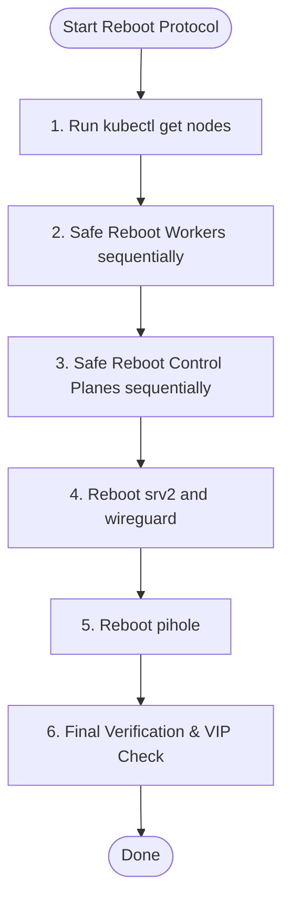

# Galaxy Rebooter Skill

## Overview

The `galaxy-rebooter` skill manages the safe, sequential rebooting of the "Marshian Galaxy" home infrastructure. The process is designed to maintain control plane high availability and data plane stability during reboots (such as after Linux kernel updates). 

It leverages the custom `helpers/reboot-galaxy.nu` Nushell script to automate draining, cordoning, rebooting, and verifying each node and VM.

---

## Infrastructure Nodes

The reboot sequence spans four groups of hosts:

| Node Group | Hostnames | OS / Role | Reboot Command | Cordon/Drain? |
| :--- | :--- | :--- | :--- | :--- |
| **K8s Workers** | `k8s4`, `k8s3` | Alpine Linux / Kubernetes Worker | `doas reboot` | Yes |
| **K8s Control Planes** | `k8s2`, `k8s1`, `k8s0` | Alpine Linux / K8s Control Plane & Worker | `doas reboot` | Yes |
| **Alpine Services** | `srv2`, `wireguard` | Alpine Linux VMs (Minecraft/NFS, VPN) | `doas reboot` | No |
| **Debian Services** | `pihole` | Debian VM (DNS/Ad-blocker) | `sudo reboot` | No |

---

## Safe Reboot Workflow

When tasked with rebooting the systems, follow this workflow sequentially:



### 1. Pre-Flight Check
Run `kubectl get nodes` to verify that all Kubernetes nodes are healthy and scheduling before initiating any reboots.

### 2. Executing the Reboot Script
Run the custom reboot script:
```bash
nu helpers/reboot-galaxy.nu
```

The script automates:
1. **Draining and Cordoning** the target K8s node (`kubectl drain <node> --ignore-daemonsets --delete-emptydir-data --force`).
2. **Rebooting** the node via SSH.
3. **Waiting** for SSH connectivity to return.
4. **Waiting** for the node to report `Ready` in Kubernetes.
5. **Uncordoning** the node (`kubectl uncordon <node>`).
6. **Verifying** Service VIP accessibility (using `curl` to check `https://git.marsh.gg` via MetalLB).

### 3. Handling Transient API Server Errors (Control Plane Reboots)
When control plane nodes (`k8s2`, `k8s1`, `k8s0`) reboot, the Kubernetes API server may become temporarily unavailable or return auth/forbidden/refused errors while services restart.
- **Robustness**: Ensure the `wait-for-k8s-node` function wraps `kubectl get node` inside a `try / catch` block to handle transient failures gracefully and retry instead of crashing.
- **Manual Intervention**: If the script aborts mid-reboot, check node status with `kubectl get nodes`. If a node returned online but remains cordoned, run `kubectl uncordon <node>`.

### 4. Resuming / Running Subsections
If the reboot protocol is interrupted (e.g., during the control plane restarts) and you only need to reboot the service VMs, you can run a targeted Nushell script or command block to reboot the remaining nodes safely without repeating the Kubernetes reboots:
```nushell
# Run only for services
ssh srv2 "doas reboot"
ssh wireguard "doas reboot"
ssh pihole "sudo reboot"
```

---

## Critical Nushell Syntax Rules

When editing or writing Nushell helper scripts for the Marshian Galaxy, follow these rules:

1. **Avoid `(exit` inside Interpolated Strings**:
   - In double-quoted interpolated strings (`$"..."`), any expression inside parentheses `(...)` is parsed as a subexpression.
   - If a literal string contains `(exit code: ...)` or similar, the Nushell parser will treat it as an invocation of the built-in `exit` command. Because `exit` expects an integer parameter, this will throw an `expected int` compilation error.
   - **Fix**: Use alternative syntax like `- exit code: ...` or single quotes, or concatenate strings to avoid putting `(exit` inside a double-quoted interpolated block.

2. **Piping to `complete` requires External Commands**:
   - Nushell's `complete` command is designed exclusively for external programs (e.g., `curl`, `ssh`).
   - Using `complete` on internal/built-in commands (e.g., `http head`) will throw a runtime error.
   - **Fix**: Use external tools like `curl -I -s --max-time 5` when you need to pipe execution results to `complete` to inspect exit codes.
